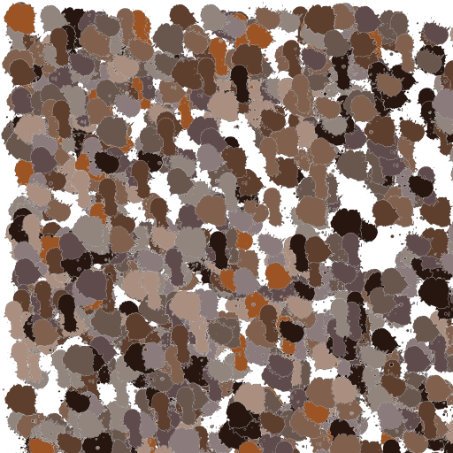
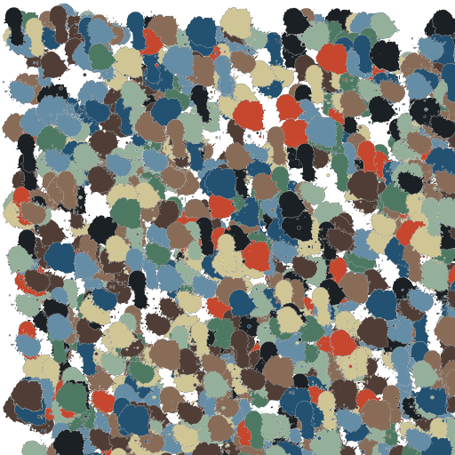
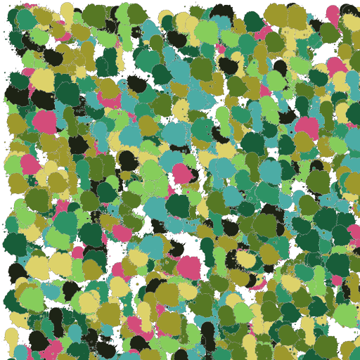

# Introduction to AI 
## Assignment 2 - Evolutionary Algorithm

### Versions

Tested with `Python 3.9.2`

### Dependencies

```shell
pip3 install -r requirements.txt
```

### Launching

```shell
python3 main.py <source> <target>
```
### Examples

Source | Target
--- | ---
 | 
 | 
 | 